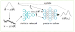

# LFI meets Image-Transformation Model Inversion Attack

This project aims to develop an image oriented framework for LFI (Likelihood-free inference) experiments. LFI algorithms aim to estimate the posterior $p(\theta|x_O)\approx \pi(\theta)$ from observed data $x_o \sim \pi(x|\theta)$, and a prior hypothesis $p(\theta)$. According to the literature, the standard way to do this is by carrying out several sampling/simulation rounds, working together with a density estimator (DE) network. Sampling is performed by establishing a prior $\theta\sim\pi(\theta)$. Whereas, simulation requires defining an stochastic process parameterized by $\theta$. Previous works have shown that LFI can be performed accurately and efficiently (e.g. use of near-sufficient statistics) on parameterized models (the prior $x\sim \pi(x)$ is parameterized by $\theta$). On the other hand, most of these LFI algorithms implementations use simple MLP models to perform Density Estimation (*crucial for LFI*), or Statistics computation. To the best of our knowledge, there are no works employing parameterized image transformations as the simulators, such that we can test SOTA LFI algorithms on them, and verify whether they can recover relevant information about the parameters $\theta$ used to generate the deformed images. Accordingly, we are following the work of [Chen et al. (ICLR 2021)](https://openreview.net/pdf?id=SRDuJssQud), on using near-sufficient statistics (trained according to the [InfoMax Principle](https://www.microsoft.com/en-us/research/blog/deep-infomax-learning-good-representations-through-mutual-information-maximization/)) to simplify LFI. Thus, we are proposing to replace the MLP networks, adopted in previous works, by CNNs, such that LFI algorithms can deal with images. The proposed framework is shown below.      

The diagram of the work by [Chen et al. (ICLR 2021)](https://openreview.net/pdf?id=SRDuJssQud) is shown below:

**Group members**
-----------------------------
|Student|ID|Email|
|-------|--|-----|
|Paulo|d12922028||
|Chevady|||
|Laguna|||
----------------------------------
**Basic definitions**

+ LFI (all the algorithms require an statistic Net and Density estimator Net) 
+ Neuralde: Neural Density Estimators
+ Statnet: Statistic Networks
+ Each Statnet requires a Critic Network 
+ Algorithms: LFI algorithms (posterior solver) 

*the notebook in examples/task_GC.ipynb can be run direcly (taken from the original repo)*

**Project Plan**
1. Implement the Image-deformation simulator (FFD deformation)✅ 
2. Implement the entire image-deformation task (sample/simulation)
2. Modify the existing Statnets (MLP) by using ResNet based, or others.
3. Modify the critic networks by using conventional CNNs.
4. Keep the same LFI algorithms, and perform the same experiments as in the original paper.
---------------------

## Getting started
